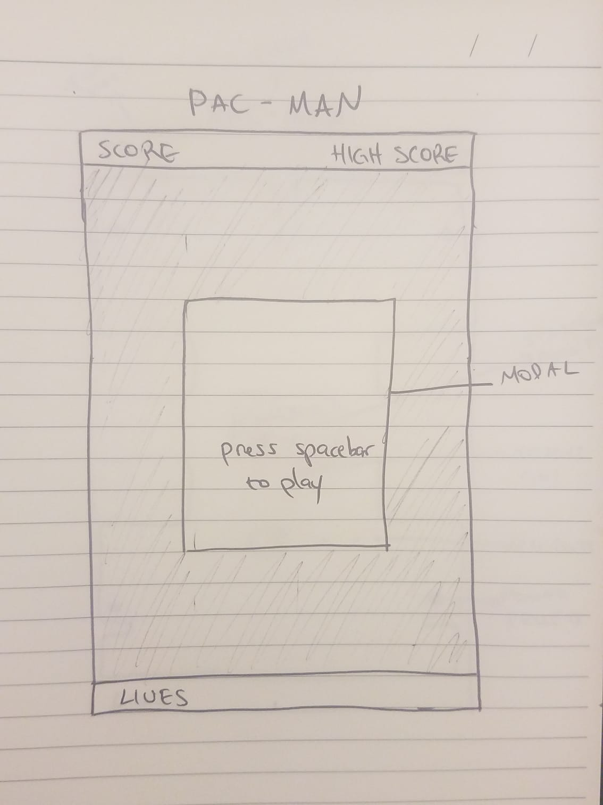

# Cap-Man

This is a clone of the popular retro arcade game!
Collect the dots to move on to the next level. Make sure not to get possessed by the ghosts!

# Technologies:
- HMTL/CSS
- Canvas
- Vanilla JavaScript
- Object Oriented Programming

# MVP's:
- Board
- Pac-Dots
- Capman
- Movement
- Sound
- Collision
- Score
- Ghosts
- Ghost/Capman collision
- Power Pellets
- Change of powers with power pellet
- Lives

BONUS:
- More levels
- Fruits for more points
- Between level animations.
- Multi-Player

Step by step:
create board with grid/maze
add pac-dots
add Capman
Capman can move around board.
Capman can move around board in the allowed spots.
Capman can go through the tunnel.
Capman can eat pac-dots.
Add sound.
score is calculated.
add ghost to board.
add movement to ghosts. (each ghost differently)
ghost can get Capman out on collision.
create game over view (with score showing).
add flashing power pellets to board.
when Capman eats pellet, Capman should become bigger.
ghosts should become blue and run away.
Capman can eat ghost.
Capman has a certain amount of lives.

# Wireframes:

# Classes:
- Board (pac-dots?)
- Capman
- Game
- Audio
- Ghosts
- Power Pellets
- KeyPresses
