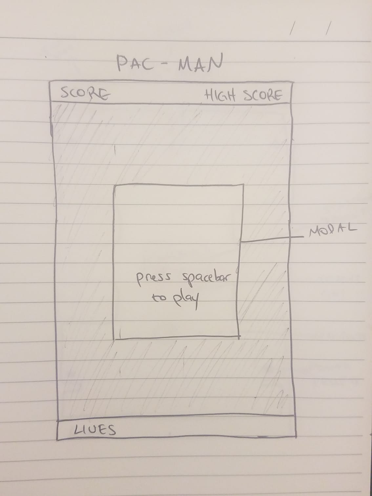
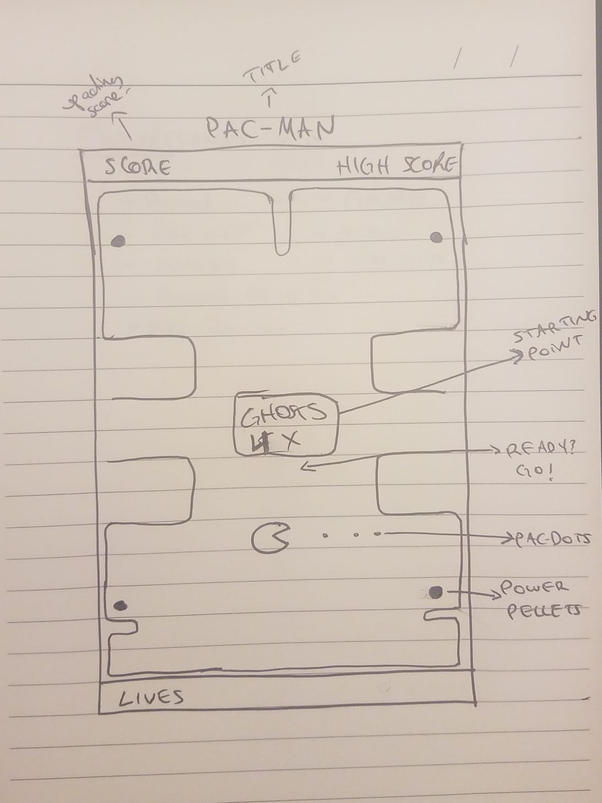

# Pacman

This is a clone of the popular retro arcade game!
Collect the dots to move on to the next level. Make sure not to get possessed by the ghosts!

# Technologies:
- HMTL/CSS
- Canvas
- Vanilla JavaScript
- Object Oriented Programming

# MVP's:
- Board
- Pac-Dots
- Pacman
- Movement
- Sound
- Collision
- Score
- Ghosts
- Ghost/Pacman collision
- Power Pellets
- Change of powers with power pellet
- Lives

BONUS:
- More levels
- Fruits for more points
- Between level animations.
- Multi-Player

Step by step:
create board with grid/maze
add pac-dots
add Pacman
pacman can move around board.
pacman can move around board in the allowed spots.
pacman can go through the tunnel.
Pacman can eat pac-dots.
Add sound.
score is calculated.
add ghost to board.
add movement to ghosts. (each ghost differently)
ghost can get pacman out on collision.
create game over view (with score showing).
add flashing power pellets to board.
when pacman eats pellet, pacman should become bigger.
ghosts should become blue and run away.
pacman can eat ghost.
pacman has a certain amount of lives.

# Wireframes:

# Classes:
- Board (pac-dots?)
- Pacman
- Game
- Audio
- Ghosts
- Power Pellets
- KeyPresses
